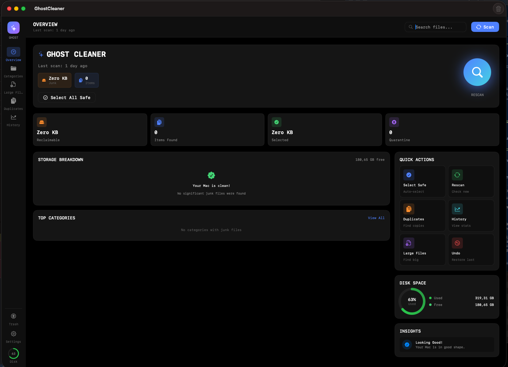
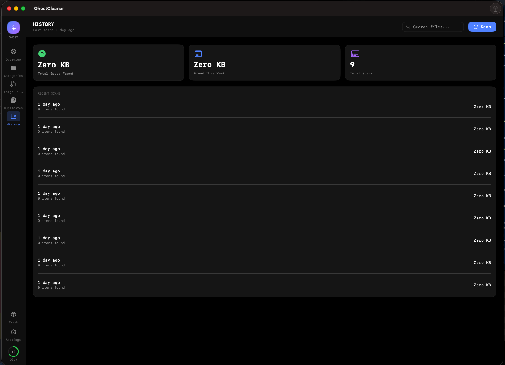

# GhostCleaner 👻

  

A powerful, privacy-focused macOS disk cleanup utility with advanced scanning,
smart risk assessment, and safe file recovery.

---

## 🖼️ Screenshots

## 🚀 Features

### 🔍 Core Functionality
- **12 Scan Categories**
  - User caches & logs
  - Downloads
  - iOS backups
  - Xcode derived data & archives
  - Swift Package Manager caches
  - Homebrew caches
  - Browser caches
  - Mail attachments
- **Deep Scan Mode**
  - Scans hidden files and package contents
- **Large Files Scanner**
  - Custom size threshold
- **Smart Risk Assessment**
  - 🟢 Safe  
  - 🟡 Review  
  - 🔴 Danger  

---

### 🛡️ Safety
- **Quarantine System**
  - Restore deleted files for up to **30 days**
- **Protected Paths**
  - Critical macOS system directories are never touched
- **User-Selected Folder Access**
  - No full-disk access required
- **Undo Support**
  - One-click restore

---

### ⚙️ Advanced
- **Scheduled Scans**
  - Daily / Weekly / Monthly
- **Scan History**
  - Full cleanup timeline
- **Export Reports**
  - PDF or HTML
- **Dark-Only UI**
  - True pitch-black theme
- **Smart Insights**
  - Cleanup recommendations

---

## 💻 System Requirements

- macOS **14.0 (Sonoma)** or later
- Apple Silicon (M1–M4) or Intel
- Fully sandboxed

---

## 📦 Installation

1. Download **GhostCleaner.app**
2. Move to **Applications**
3. Launch and grant folder access when prompted

---

## 🔐 Privacy & Permissions

GhostCleaner only scans folders **you explicitly approve**:
- Caches & logs
- Downloads
- Developer tools (Xcode, Homebrew, SwiftPM)
- Browser caches and mail attachments

All permissions use **security-scoped bookmarks**.  
No telemetry. No background scanning.

---

## 🏷️ Version

**v1.0 – Initial Release**
- 12 scan categories
- Deep scan
- Large file management
- Scheduled scanning
- Full sandbox compliance

---

© 2026 GhostCleaner. All rights reserved.
